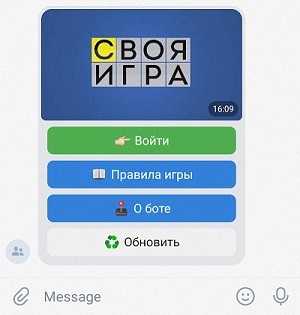
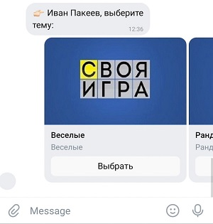
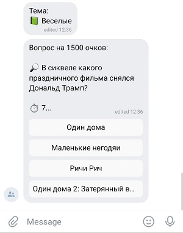
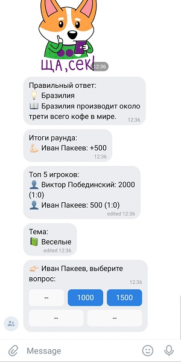
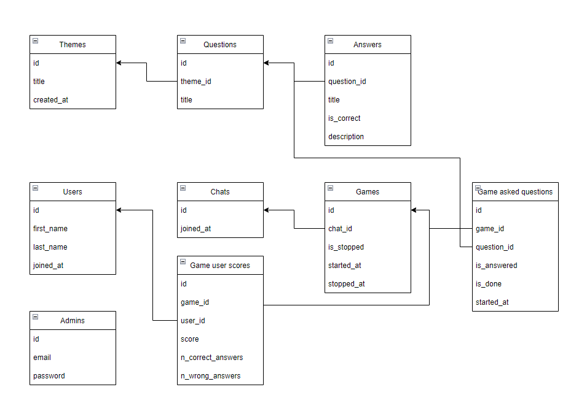
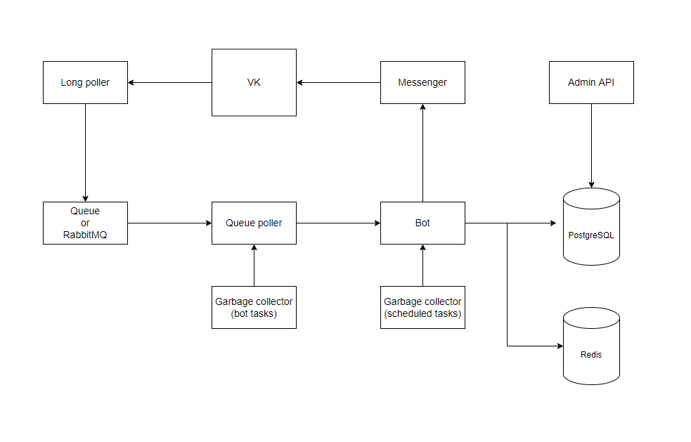
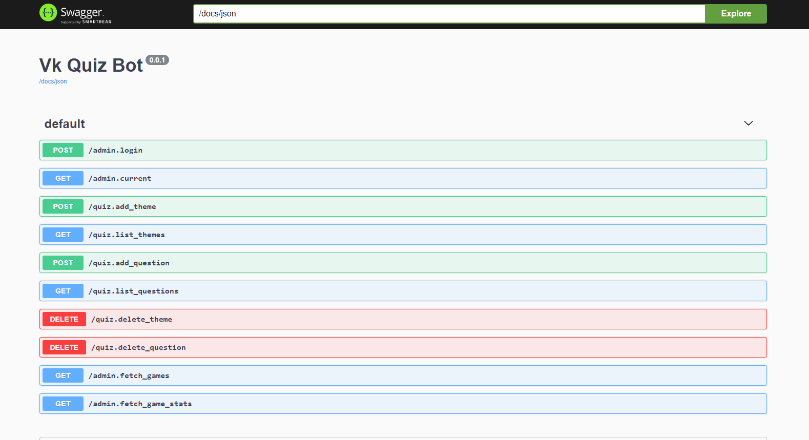

Я - бот для игры в викторину (по примеру "Своя игра").

*Команды*:  
👉🏻 "/start" - начать новую сессию  
👉🏻 "/stop" - завершить игру во время выбора вопроса.

*Правила игры:*  
👉🏻 Основная задача игры - заработать как можно больше очков, правильно отвечая на вопросы.  
👉🏻 Первый вопрос выбирает тот, кто первым нажал на кнопку Старт.  
👉🏻 Каждый вопрос имеет свою стоимость (от 500 до 2500).  
👉🏻 Очки начисляются первому, кто правильно ответил на вопрос. Он же имеет право на выбор следующего вопроса.  
👉🏻 За неправильный ответ снимаются очки в количестве стоимости вопроса.  
👉🏻 Если не знаете ответ - можете не отвечать.  
👉🏻 Если по прошествии 10 секунд никто не ответил или не было правильного ответа, то предлагается выбор другого
вопроса.  
👉🏻 Вы можете завершить игру после любого раунда.

*Демонстрация*:

